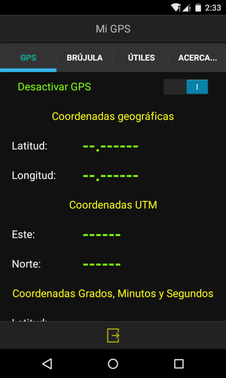
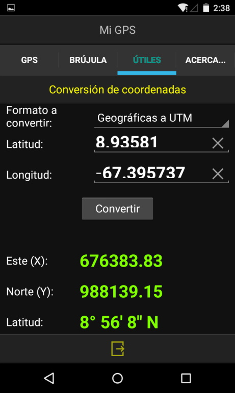
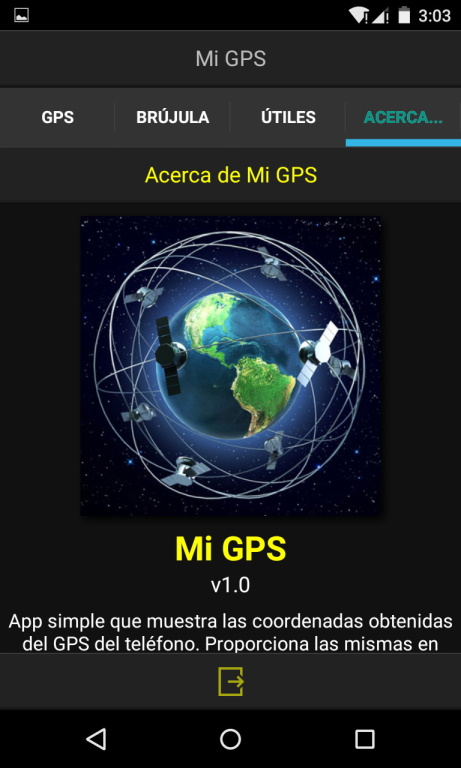

# Mi GPS

---

## Descripción

App Android simple que muestra las coordenadas obtenidas del GPS del teléfono. Proporciona las mismas en formato geográfico, UTM y grados / minutos / segundos. También incorpora una brújula, así como además un conversor de unidades.

## Notas

* Es desarrollado únicamente con intenciones de aprendizaje.

---

## Lenguaje/framework

* Lenguaje: Delphi 10.2 Tokyo, empleando sólo componentes nativos. 
* Framework: Firemonkey. 

---

## Autor

Ing. Francisco José Sáez Soto.

e-mail: **fjsaez@gmail.com**

LinkedIn: **linkedin.com/in/francisco-josé-sáez-soto**

GitHub: **github.com/fjsaez**

---

Calabozo (Venezuela), 26 de octubre de 2019.

---

## Imágenes de la app

### Icono

### Pantallas

### Acerca...

